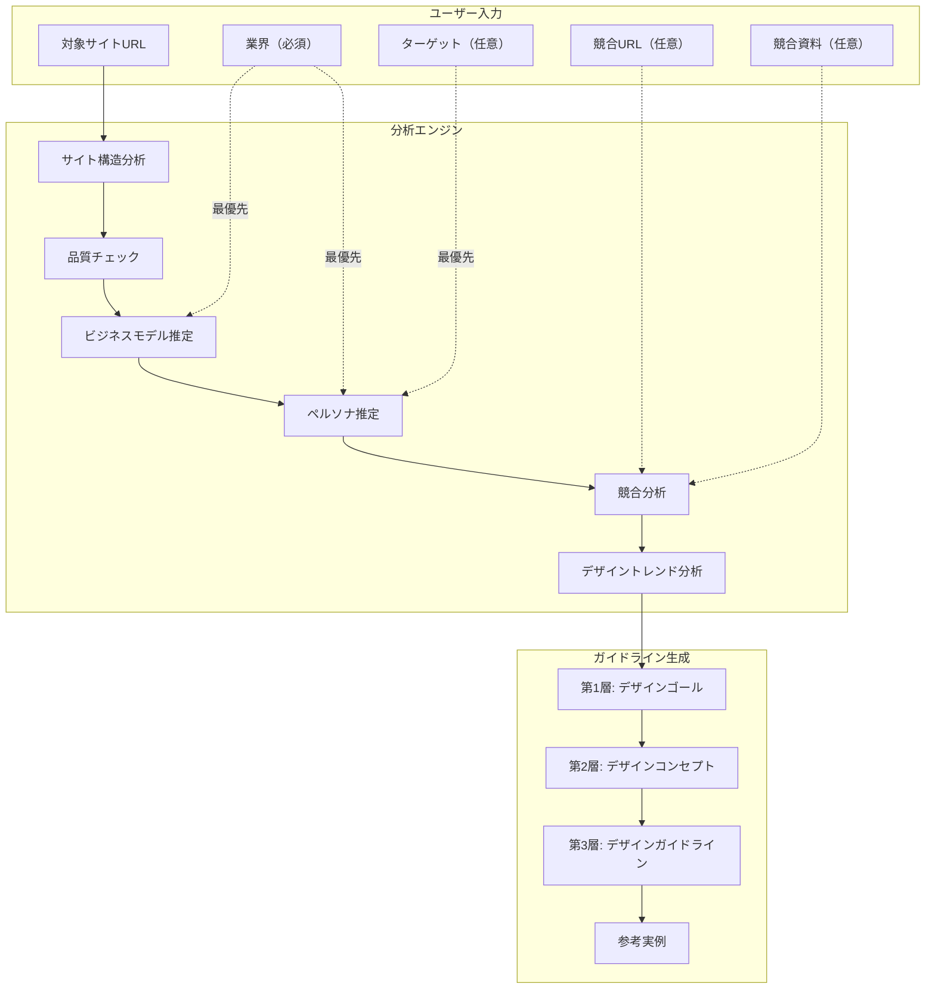

# データフロー・インプット活用設計

> **最終更新**: 2026-02-05
> 
> このドキュメントは、システムがサイトURLから情報を取得し、3層構造のデザインガイドラインを生成するまでのデータフローを説明します。
> 実装変更時は必ずこのドキュメントも更新してください。

## システム全体のデータフロー



---

## ユーザー入力の活用方針

| ユーザー入力 | 活用方法 | 優先順位 |
|-------------|---------|---------|
| **業界** | ビジネスモデル・ペルソナ推定の最重要ヒント | 最優先（サイト分析結果より優先） |
| **ターゲット** | ペルソナ設計の基準 | 最優先（AI推定より優先） |
| **競合URL** | 自動検出をスキップし指定URLを分析 | 指定があれば使用 |
| **競合資料** | 手動アップロード資料から競合情報を抽出 | 指定があれば使用 |

---

## 1. サイト構造分析で取得する情報

**実装**: [`src/lib/analysis-engine/site-analyzer.ts`](../src/lib/analysis-engine/site-analyzer.ts)

入力URLからHTMLをfetch + cheerioでパースし、以下を抽出:

| カテゴリ | 取得情報 | 取得方法 |
|---------|---------|---------|
| **基本情報** | title, meta description | `<title>`, `<meta name="description">` |
| **コンテンツ構造** | 見出し(H1-H4), セクション | タグ名・クラス名から抽出 |
| **CTA** | ボタンテキスト、タイプ、配置 | `.btn`, `button`, `[href*="contact"]` など |
| **信頼性要素** | testimonials, clientLogos, certifications, statistics, mediaFeatures | クラス名パターンマッチ（boolean） |
| **ビジュアル** | 画像(src/alt/context), 動画有無, アニメーション有無 | ``, `<video>`, クラス名 |
| **技術情報** | フォント名, カラー(HEX/RGB) | Google Fonts URL, `<style>` タグ内 |
| **本文** | メインコンテンツ（10,000文字まで） | `<main>`, `<article>`, `.content` など |

### 品質チェック機能

サイト分析後、`calculateAnalysisQuality()`で分析品質スコア（0-100）を算出:

| 項目 | 減点 |
|-----|-----|
| タイトル取得失敗 | -30点 |
| メインコンテンツ不足（<100文字） | -40点 |
| メインコンテンツ少量（<500文字） | -20点 |
| 見出しなし | -15点 |
| CTAなし | -10点 |
| メタディスクリプションなし | -5点 |

**スコアが70未満の場合**: コンソールに警告を出力し、URLとタイトル・ユーザー入力の業界情報を基に分析を続行。

---

## 2. 分析エンジンの各ステップ

**実装**: [`src/lib/analysis-engine/index.ts`](../src/lib/analysis-engine/index.ts)

5つの分析ステップを順次実行:

### Step 1: サイト構造分析

- **実行条件**: 常に実行
- **出力**: `SiteAnalysis`（上記の取得情報すべて）
- **品質チェック**: 分析品質スコアをログ出力

### Step 2: ビジネスモデル推定

**実装**: [`src/lib/analysis-engine/modules/business-model.ts`](../src/lib/analysis-engine/modules/business-model.ts)

- **実行条件**: **常に実行**（ユーザーが業界を指定していても詳細情報を取得）
- **入力**:
  - **ユーザー入力の業界（最優先）**
  - サイト分析結果（URL, タイトル, 見出し, CTA, メインコンテンツ）
- **分析の優先順位**:
  1. ユーザー指定の業界（最優先）
  2. URLに含まれるキーワード
  3. サイトタイトル
  4. メインコンテンツ
- **業界別の典型的なビジネスモデルガイド**:

| 業界 | サービスタイプ | 収益モデル | CV目標 |
|-----|--------------|----------|-------|
| ピラティス・ヨガ・フィットネス | B2C | 月謝制/回数券 | 体験レッスン申込 |
| 美容室・エステ・ネイル | B2C | 都度払い/回数券 | 予約・カウンセリング |
| クリニック・歯科・整体 | B2C | 都度払い/保険診療 | 予約・問い合わせ |
| IT・SaaS | B2B/B2C | サブスクリプション | 無料トライアル・資料請求 |
| コンサルティング | B2B | プロジェクト/顧問契約 | 問い合わせ・資料請求 |

- **出力**: `BusinessModelAnalysis`
  - industry（ユーザー入力があれば優先）
  - serviceType（B2B/B2C等）
  - conversionGoal（コンバージョン目標）
  - competitiveAdvantage（競合優位性）

### Step 3: ペルソナ推定

**実装**: [`src/lib/analysis-engine/modules/persona.ts`](../src/lib/analysis-engine/modules/persona.ts)

- **実行条件**: **常に実行**（ユーザーがターゲットを指定していても詳細情報を取得）
- **入力**:
  - **ユーザー入力のターゲット（最優先）**
  - **ユーザー入力の業界 / ビジネスモデル分析結果**
  - サイト分析結果
- **業界別の典型的なターゲット層ガイド**:

| 業界 | 典型的なターゲット層 |
|-----|-------------------|
| 健康・フィットネス | 健康意識の高い一般消費者、20-50代 |
| 美容サービス | 美容に関心のある消費者、20-40代女性中心 |
| 医療・ヘルスケア | 健康に悩みを持つ消費者、幅広い年代 |
| IT・SaaS（B2B） | 企業の担当者・経営者 |
| コンサルティング | 企業の経営者・役員 |

- **出力**: `PersonaAnalysis`
  - primary（メインペルソナ: 年齢, 職業, ゴール, ペインポイント等）
  - psychographics（価値観, 懸念, 動機）

### Step 4: 競合分析

**実装**: [`src/lib/analysis-engine/modules/competitor.ts`](../src/lib/analysis-engine/modules/competitor.ts)

- **実行条件**: 常に実行
- **入力**: 
  - サイト分析 + ビジネスモデル + 業界情報
  - ユーザー指定の競合URL（あれば）
  - アップロードされた競合資料（あれば）
- **処理**:
  1. 手動アップロード資料があれば解析（`competitorDocuments`）
  2. `competitorImportMode`が`manual_only`ならここで終了
  3. 競合URLが未指定なら、Brave APIで類似サイト検索 → Claude推定で補完
  4. 各競合URLをスクレイピング
  5. 各競合の詳細分析をClaude呼び出しで実行
- **出力**: `CompetitorAnalysis[]`
  - デザイントーン, カラースキーム, タイポグラフィ
  - ポジショニングタイプ（price/authority/design/content/campaign）
  - 権威性要素、体験談スタイル
  - 強み/弱み, 差別化ポイント

### Step 5: デザイントレンド分析

**実装**: [`src/lib/analysis-engine/modules/design-trend.ts`](../src/lib/analysis-engine/modules/design-trend.ts)

- **実行条件**: 常に実行
- **入力**: サイト分析 + ビジネスモデル + 競合分析結果
- **Claude呼び出し**: 業界のデザイントレンドを分析
- **出力**: `DesignTrendAnalysis`
  - trends（カラー/タイポグラフィ/レイアウト/ビジュアルのトレンド）
  - conventions（業界の当たり前パターン）
  - opportunities（差別化機会）
  - antiPatterns（避けるべきパターン）

---

## 3. ガイドライン生成での活用

**実装**: [`src/lib/guideline-generator.ts`](../src/lib/guideline-generator.ts)

3層構造のガイドラインを生成:

### 第1層: デザインゴール（Layer1Goals）

**使用する分析結果**:
- サイト分析: URL, タイトル, 説明
- ビジネスモデル: 業界, サービスタイプ, コンバージョン目標, 競合優位性
- ペルソナ: 名前, 年齢, 職業, ゴール, ペインポイント, 価値観
- 競合分析: 各競合の名前, ポジション, トーン, 強み
- デザイントレンド: 業界慣習, 差別化機会, 避けるべきパターン

**生成内容**:
- `differentiationPoints`: 差別化ポイント3-5項目
- `impressionKeywords`: ユーザーに感じてもらうべき印象5-7個
- `summary`: ゴールサマリー

### 第2層: デザインコンセプト（Layer2Concept）

**使用する分析結果**:
- **Layer1Goals**: 差別化ポイント, 印象キーワード
- サイト分析: タイトル
- ビジネスモデル: 業界, コンバージョン目標
- ペルソナ: メインペルソナ名
- 競合分析: 各競合のデザイントーン

**生成内容**:
- `statement`: コンセプトステートメント
- `principles`: デザイン原則4-5項目
- `positioning`: LPの位置づけ
- `prohibitions`: 禁止事項3-4項目

### 第3層: デザインガイドライン（Layer3Guidelines）

**使用する分析結果**:
- **Layer1Goals + Layer2Concept**
- サイト分析: タイトル, 説明, 見出し
- ビジネスモデル: 業界
- ペルソナ: メインペルソナ
- 競合分析: 各競合のカラースキーム, タイポグラフィ, スタイル
- **ナレッジベース**:
  - 業種別プリセット（[`lib/knowledge/industry-presets.ts`](../src/lib/knowledge/industry-presets.ts)）
  - カラー戦略（[`lib/knowledge/color-strategy.ts`](../src/lib/knowledge/color-strategy.ts)）
  - フォント戦略（[`lib/knowledge/font-strategy.ts`](../src/lib/knowledge/font-strategy.ts)）

**生成内容**:
- `typography`: フォント名, サイズ, ウェイト, ジャンプ率（具体的なpx値）
- `color`: メイン/サブ/アクセントカラー（HEX値 + 心理的根拠）
- `visual`: 写真トーン, イラストスタイル, NG例
- `layout`: グリッド, スペーシング, ブレークポイント
- `ui`: ボタンスタイル, CTA改善提案

---

## 4. データフローの保証

### ユーザー入力の伝播

| ユーザー入力 | 伝播先 | 実装箇所 |
|-------------|-------|---------|
| `industry` | ビジネスモデル分析（最優先） | `business-model.ts` |
| `industry` | ペルソナ分析（最優先） | `persona.ts` |
| `industry` | 競合分析 | `competitor.ts` |
| `industry` | デザイントレンド分析 | `design-trend.ts` |
| `industry` | Layer1-3生成 | `guideline-generator.ts` |
| `targetAudience` | ペルソナ分析（最優先） | `persona.ts` |
| `targetAudience` | Layer2生成 | `guideline-generator.ts` |

### 各ステップの依存関係

```
Step1: サイト分析
  ↓ siteAnalysis
Step2: ビジネスモデル推定 ← [ユーザー入力: industry]
  ↓ siteAnalysis + businessModel
Step3: ペルソナ推定 ← [ユーザー入力: industry, targetAudience]
  ↓ siteAnalysis + businessModel + persona
Step4: 競合分析 ← [ユーザー入力: competitorUrls, competitorDocuments]
  ↓ siteAnalysis + businessModel + persona + competitors
Step5: デザイントレンド分析
  ↓ 全分析結果
Layer1: デザインゴール
  ↓ Layer1Goals
Layer2: デザインコンセプト
  ↓ Layer1Goals + Layer2Concept
Layer3: デザインガイドライン
```

---

## 5. 現在の設計の特徴

### 強み

- ユーザー入力（業界・ターゲット）を最優先で活用
- サイト分析で取得した情報が全ステップに伝播し、文脈を維持
- サイト分析が不十分でも、ユーザー入力と業界知識から適切に推定
- 競合分析結果が差別化ポイントの根拠になる
- 業種別ナレッジベースで具体的な推奨値を提供
- 各選択に心理的根拠を付与
- 品質チェック機能で問題発生時の診断が容易

### 改善余地

- サイト分析で取得できる情報が限定的（CSS解析が不完全）
- 画像内容の分析なし（現状はalt属性とコンテキストのみ）
- スクリーンショット機能が未実装（型定義にはあるが使われていない）

---

## 更新履歴

| 日付 | 変更内容 |
|-----|---------|
| 2026-02-05 | 初版作成。ビジネスモデル・ペルソナ分析を常時実行に変更、ユーザー入力優先ロジック追加、品質チェック機能追加 |
